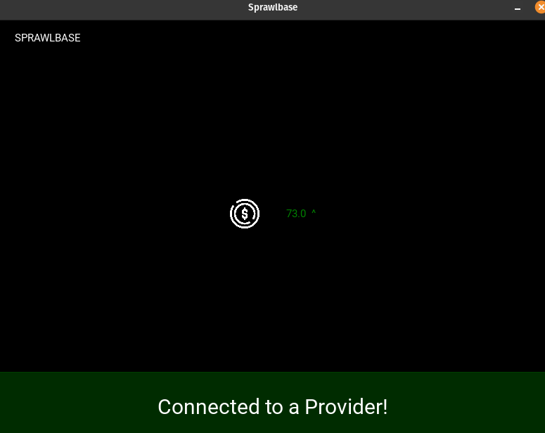
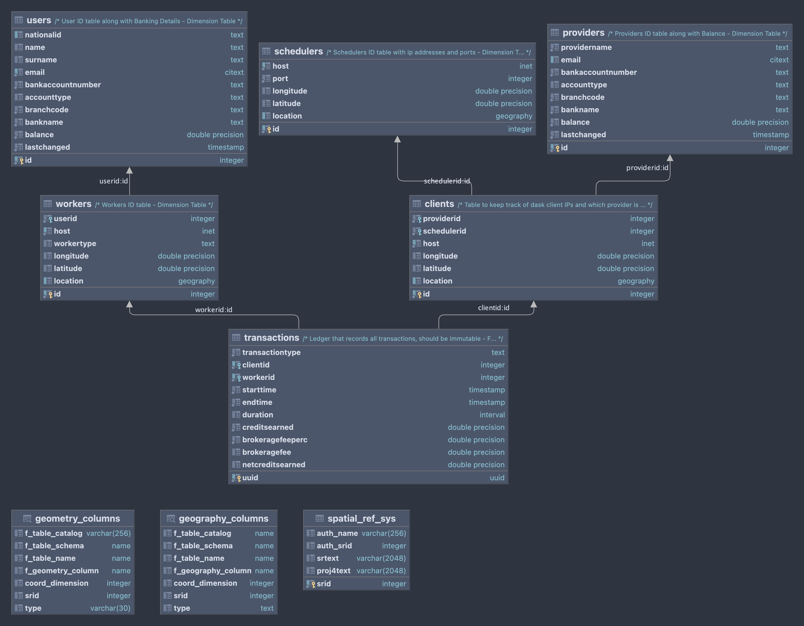

# SprawlHub

The sprawling network of community driven computation and storage.

This is the Postgres Server and Web Framework that manages scheduler/worker/DB interactions.

## App Fronted

## ERD

